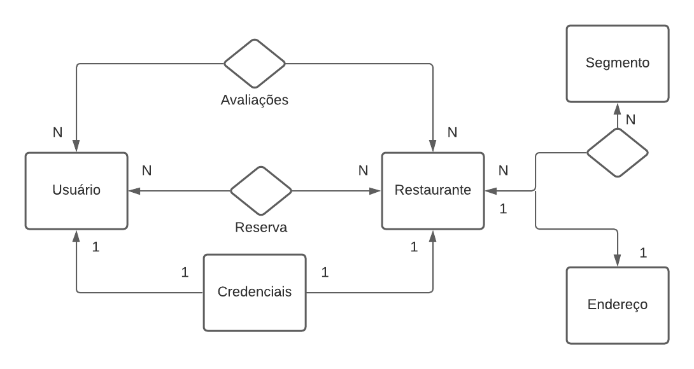

<h1 align="center"> Projeto UC - Expo São Judas 2021 </h1>


<div>
    
</div>

<h4 align="center"><a href="https://www.figma.com/file/91LEOxx5kjGrEgKtLB1Vor/Untitled?node-id=46%3A0">Clique para visitar o protótipo do projeto</a></h4>


## 📝 Problema
Como usar a tecnologia e criar formas de atrair e auxiliar na integração de clientes, donos de estabelecimentos alimentícios de forma gradual e segura?

---

## 💼 Produto
Ajudar as pessoas a realizarem reservas em estabelecimentos ao mesmo tempo tendo a quantidade de lotação no local, o que encurtará o tempo de espera. 

Do outro lado, contribuir para que os estabelecimentos tenham um controle melhor da lotação do lugar, podendo ter uma estimativa de fluxo de pessoas antes mesmo de abrir.

---

## 💻 Tecnologia

TemReserva consiste em um site responsivo criado em Angular, possuindo um Backend em Java para  ajudar as pessoas que desejam ir a algum restaurante,  com isso fornecendo informações necessárias sobre o estabelecimento.

O site opera com duas formas de autenticação, uma para o cliente que deseja visualizar os restaurantes e assim realizar uma reserva através do nosso site, e uma para o próprio estabelecimento, que consegue disponibilizar suas informações e deixar seu estabalecimento visível aos clientes interessados. 

A escolha do framework Angular para o desenvollvimento foi pela produtividade e facilidade que ele nos da na criação da SPA. E o Spring Boot também foi pela produtividade que ele nos dá, pois com ele não é necessário ter que criar um projeto Java do zero.

**Diagrama**

<div>
    
</div>

---

## 🚀 Instalando Tem Reserva?

Para instalar o Tem Reserva?, siga estas etapas:

Linux e macOS:
```
<comando_de_instalação>
```

Windows:
```
<comando_de_instalação>
```

---

## 😄 Usando Tem Reserva?

Para usar Tem Reserva?, siga estas etapas:

```
<exemplo_de_uso>
```

---

## 🤝 Equipe

<table>
  <tr>
    <td align="center">
      <a href="#">
        <br>
        <sub>
          <b>Ananda Gurgel</b>
        </sub>
      </a>
    </td>
    <td align="center">
      <a href="#">
        <br>
        <sub>
          <b>Audrey Nogueira</b>
        </sub>
      </a>
    </td>
    <td align="center">
      <a href="#">
        <br>
        <sub>
          <b>Enzo Thomazi</b>
        </sub>
      </a>
    </td>
        <td align="center">
      <a href="#">
        <br>
        <sub>
          <b>Erick Harada</b>
        </sub>
      </a>
    </td>
  </tr>
</table>
